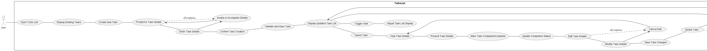
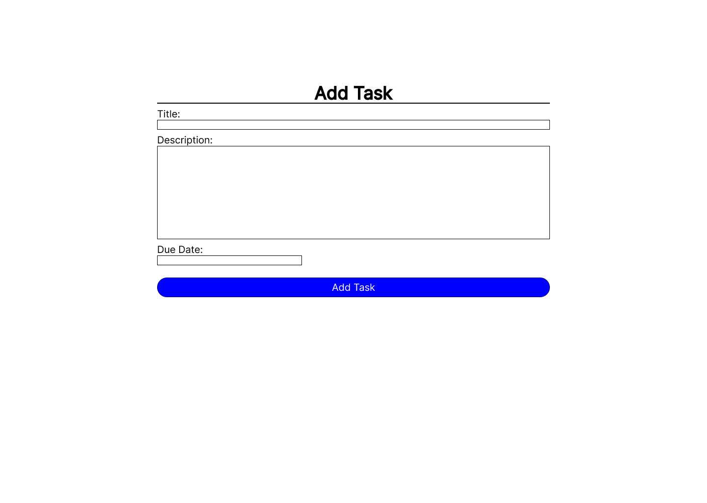
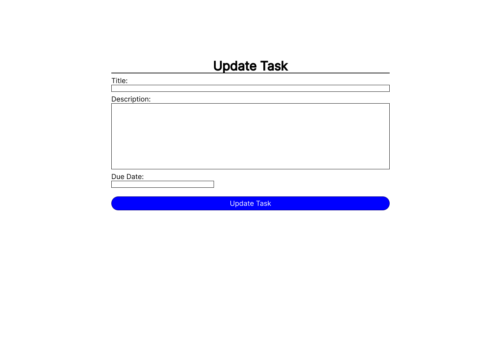
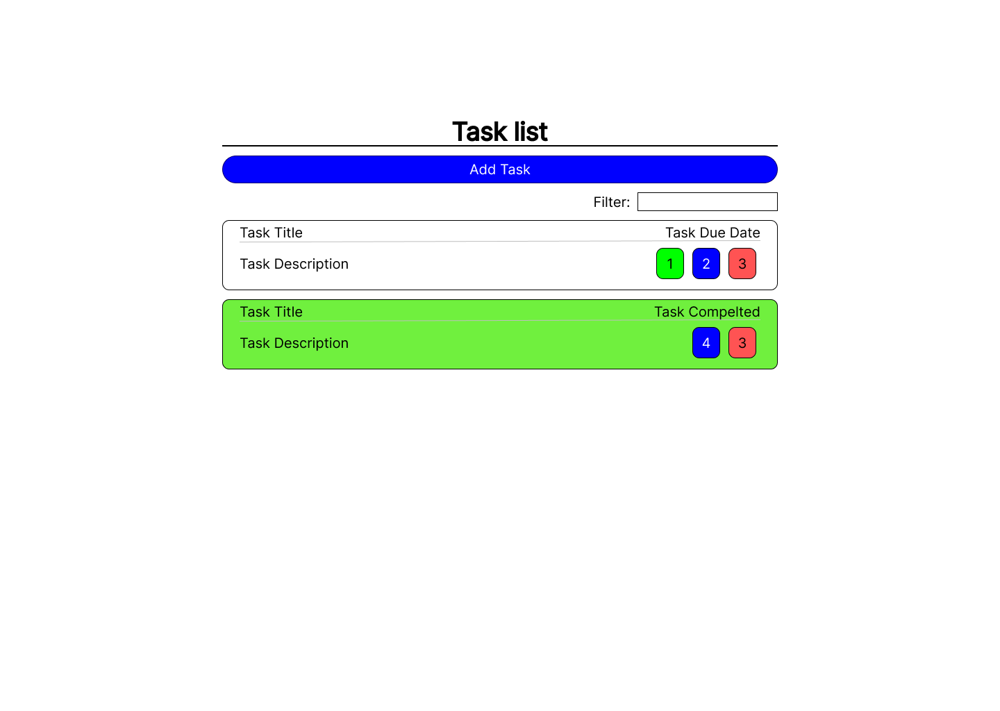

# Problem 1

------------------------------------------------------------------------------

## Problem Summary and Complexity

### Summary

The task is to create a ToDo list application that allows users to create and delete tasks. It should have the ability to track the completion state of tasks and mark them as complete. The tasks should have fields for title, description, and due date, which can be edited. The application should display a list of tasks and provide an option to toggle between displaying all tasks or only incomplete ones.

### Complexity

Implementing a ToDo list application involves various complexities, including designing a user-friendly interface, establishing efficient data storage, managing task dependencies and notifications, handling synchronization across devices or users, ensuring error handling and performance, implementing security measures, and conducting thorough testing and quality assurance. However, the complexity can be reduced by focusing on the minimum requirements mentioned in the task description.

### Constraints

The constraints of the ToDo list problem encompass functional requirements, user interface guidelines, technology choices, performance expectations, data storage considerations, compatibility requirements, and time/resource limitations. Adhering to these constraints ensures that the ToDo list application meets the specified criteria and operates effectively within the given parameters.

### Intended users

The ToDo list solution caters to a diverse range of users, including individuals, professionals, students, teams, small businesses, freelancers, event planners, and home users. It offers a versatile task management tool for organizing and prioritizing tasks, whether for personal, work, academic, or collaborative purposes. By tailoring the solution to meet the specific needs of these user groups, it enables efficient task tracking and helps users stay organized and productive.

### Required interactivity

The use case diagram is very long and will appear very small in this document. To view the full image so you can zoom in and have a look at it please use this link [Use Case Diagram](https://wtsmplkknqdfbvxfuqgd.supabase.co/storage/v1/object/public/College%20assets/U16A2/useCaseDiagram.png?t=2023-06-04T19%3A15%3A39.505Z)



------------------------------------------------------------------------------

## Data Dictionary

### Data Structures

- ```TaskModel```: Represents the structure of a task with properties like Title, Description, DueDate, Created, and Completed.
- ```UpdatedTaskModel``` (inherits TaskModel): Extends the TaskModel to include additional properties like id and Created.
- ```List<dynamic> data```: Stores the fetched data for a specific task.

### Control Structures

- if statement: Checks if the title or description is empty or contains only whitespace when adding a new task.
- foreach loop: Iterates over the list of tasks to display them on the index page.

### Data Storage

- SQLite Database: The program uses SQLite to store task data. The SQLiteDataService class handles database connections and executes queries.

### Pre-defined Code/Assets

- Blazor Server App template: The project is built using the Blazor Server App template, providing the basic structure and configuration for a Blazor server-side application.
- CSS Styles: Various CSS styles are defined within the Razor files to handle the visual presentation of the components.

------------------------------------------------------------------------------

## Aesthetic Designs

Key for task list image:

1. Mark task as complete button
2. Edit task button
3. Delete task button

<div style="display: flex;">
    
    
    
</div>

Larger version can be viewed using these links:

- [Task List](https://wtsmplkknqdfbvxfuqgd.supabase.co/storage/v1/object/public/College%20assets/U16A2/Task%20List.png?t=2023-06-05T18%3A56%3A37.444Z)
- [Add task](https://wtsmplkknqdfbvxfuqgd.supabase.co/storage/v1/object/public/College%20assets/U16A2/Add-Task.png?t=2023-06-05T18%3A56%3A59.646Z)
- [Edit Task](https://wtsmplkknqdfbvxfuqgd.supabase.co/storage/v1/object/public/College%20assets/U16A2/Edit-Task.png?t=2023-06-05T18%3A57%3A23.095Z)

-------------------------------------------------------------------------------

## Design Review and Refinement

Devon Wyatt:
"It's a great designed UI with good looks and clear use. One thing that can be improved on is a key or something to tell the user what each of the buttons do. Another thing is that there is no way that i can see of unmarking a task as complete, so if you accidentally mark a task as complete you can't reverse that."

## Response to feedback

The application doesn't rely on a key for functionality instead, it utilizes intuitive icons to represent each button's actions. In response to your feedback, I have added a new button on the task list screen that allows users to mark tasks as incomplete. This way, if you mistakenly mark a task as complete, you can easily revert it back to its original state.

## Updated design

Added a 4 button for uncompleting a task



Larger version can be viewed using these links:

- [Updated Task List](https://wtsmplkknqdfbvxfuqgd.supabase.co/storage/v1/object/public/College%20assets/U16A2/Updated-Task-List.png?t=2023-06-05T19%3A14%3A28.564Z)

-------------------------------------------------------------------------------

## Evaluation of Final Products

The programs fulfils the requirements by providing the necessary functionalities. For example, in the Add-
Task.razor file, a form is provided for users to create new tasks, fulfilling the requirement for task creation. The
`DeleteTask` method in the Index.razor file allows users to delete tasks, fulfilling the requirement for task
deletion. The Index.razor file also displays a list of tasks, fulfilling the requirement for task listing. The
`ToggleComplete` method in the Index.razor file allows users to toggle the completion status of tasks, fulfilling
the requirement for tracking the done state and allowing tasks to be set as complete. The ability to display all
tasks or only incomplete tasks is implemented in the Index.razor file with the `IsShowingIncompleteTasks`
property, fulfilling the requirement for toggling the display of tasks.

The code exhibits good code quality practices. For example, in the Add-Task.razor file, meaningful variable
names such as "Task.Title" and "Task.Description" are used, improving code readability. The use of `@bind` in
the input elements allows for two-way data binding, simplifying data manipulation. The code structure in the
`SQLiteDataService` class follows the principles of encapsulation, encapsulating the database connection and
query execution. The separation of concerns is evident in the use of separate files for different functionalities,
promoting code organization and maintainability.

The code demonstrates good performance considerations. For example, in the `SQLiteDataService` class, the
`SQLiteConnection` is properly disposed of using the "`using`" statement, ensuring efficient resource
management. The use of Dapper's `Query` method in the `QueryData` method allows for efficient database
queries and retrieval of data. The code in the Edit-Task.razor file efficiently fetches and updates task data from the database by querying based on the task ID. Overall, the code follows best practices for handling database
connections and queries, contributing to good performance.

<style>
    h1,h2,h3,h4,h5,h6{
        font-weight: bold;
        text-decoration: underline;
    }
</style>
