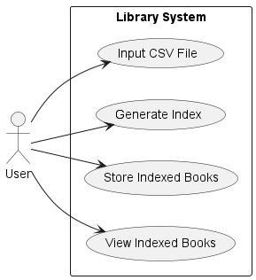
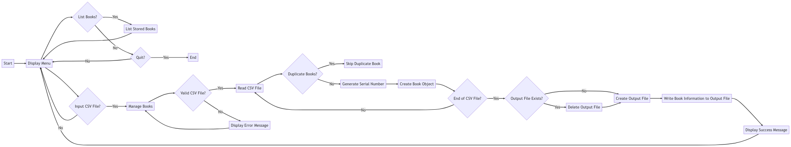

# Problem 1

------------------------------------------------------------------------------

## Problem Summary and Complexity

### Summary

The task is to create a program for a college library that reads book details from a CSV file, generates unique index references for each book, and stores the indexed book details in a new CSV file. The program should include a separate class for allocating serial numbers, providing flexibility for different serial number generation implementations in the future

### Complexity

- File Input/Output: Reading book details from a CSV file and writing indexed book details to a new CSV file involves file input/output operations. The complexity of these operations depends on the size of the input file and the number of books to be processed.

- String Manipulation: Extracting and manipulating book details such as title, author, publisher, and publication date involves string manipulation operations. The complexity of these operations depends on the length of the strings and the number of books.

- Unique Index Generation: Generating unique index references for each book requires ensuring that the generated indexes are not duplicated. This typically involves maintaining a data structure to keep track of allocated indexes and checking for uniqueness. The complexity of this operation depends on the number of books and the chosen approach for generating unique indexes.

- Error Handling: Handling potential errors such as missing input files, invalid file formats, or exceptions during file operations requires implementing appropriate error handling mechanisms. The complexity of error handling depends on the number of potential error scenarios and the desired level of robustness.

### Constraints

- CSV File Format: The program should read book details from a CSV file with a specific format.
- Data Fields: The book details consist of specific fields (title, author, publisher, publication date) that need to be handled correctly.
- Unique Indexing: Unique index references should be generated for each book, ensuring uniqueness across all books.
- Serial Number Generation: The program should provide a separate class for allocating serial numbers, allowing for alternative implementations.
- Error Handling: Potential errors such as missing files or exceptions during file operations should be handled appropriately.
- Performance: The program should handle a reasonable number of books efficiently, without excessive memory usage or execution time.
- Compatibility: The program should be implemented using a compatible programming language and framework for the intended platform.

### Intended users

The intended users of the solution are the staff or administrators of the college library. They will be responsible for managing the library's books and using the solution to add the books to a new index system. The solution will assist them in automatically reading book details from a CSV file, generating unique index references, and storing the indexed book details in a new CSV file. The solution is designed to simplify and streamline the process of organizing and indexing the library's book collection.

### Required interactivity



------------------------------------------------------------------------------

## Data Dictionary

### Data Structures

- ```Dictionary<string, Book>```: A dictionary used in the BookManager class to store books, where each book is identified by a unique serial number.
- ```Book```: A class representing a book, with properties such as SerialNumber, Title, Author, PlacePublication, Publisher, and PublicationDate.
- ```List<string>```: In the CurrentBooks class, the ```List<string>``` data structure is used to store the lines read from the output file. It is used temporarily to store the book details before printing them to the console.
- ```StringBuilder```: The StringBuilder class is used in the SerialNumberGenerator class to construct the generated serial number string. It is used to efficiently concatenate the hash-based values.
- ```StreamWriter```: The StreamWriter class is used in the BookManager class to write the book details to the output file. It provides a convenient way to write text to a file.
- FileStream/FileMode: In the BookManager class, the FileStream class is used to create or delete the output file. The FileMode enumeration is used to specify whether the file is created or overwritten.

### Control Structures

- While Loop: Used in the Program.cs file to create a main loop for the console menu, allowing the user to perform different actions until they choose to quit.
- Switch Statement: Used in the Program.cs file to handle different user input options and perform corresponding actions based on the selected option.

### Data Storage

- CSV Files: The program reads book details from a CSV file (input file) and stores the indexed book details in a new CSV file (output file).

### Pre-defined Code and Assets

- Microsoft.VisualBasic.FileIO: A namespace used to provide functionality for reading and writing CSV files using the TextFieldParser class.
- System.Security.Cryptography: A namespace used to generate a hash-based serial number for the books using SHA256 encryption.
- System.Text: A namespace used for string manipulation and encoding operations.
- SerialNumberGenerator.HashBasedSerialNumberGenerator: A class implementing the ISerialNumberGenerator interface to generate unique serial numbers for the books based on their details.

------------------------------------------------------------------------------

## Algorithm Designs



A larger version can be viewed here: [Flow Chart](https://wtsmplkknqdfbvxfuqgd.supabase.co/storage/v1/object/public/College%20assets/U16A2/FlowChart.png?t=2023-06-06T10%3A55%3A31.512Z)


A larger version can be viewed here: [Class Diagram](https://wtsmplkknqdfbvxfuqgd.supabase.co/storage/v1/object/public/College%20assets/U16A2/useCaseDiagram.png?t=2023-06-06T17%3A50%3A46.562Z)

------------------------------------------------------------------------------

## Review

ChatGPT:
"The provided program closely meets the client requirements. It successfully reads book details (title, author, publisher, publication date) from a CSV file using the BookManager class and utilizes a separate class, SerialNumberGenerator, to generate unique index references (serial numbers) for each book. The program then writes the book details along with the serial numbers to a new CSV file. The SerialNumberGenerator class implements the ISerialNumberGenerator interface, allowing for future alternative implementations. Overall, the program effectively addresses all the client requirements by employing separate classes, CSV file operations, and a flexible interface for serial number allocation."

### Response to feedback

The program successfully reads book details from a CSV file and generates unique serial numbers for each book. It then writes the book details and serial numbers to a new CSV file. The program's use of separate classes, CSV file operations, and a flexible interface for serial number allocation ensures it addresses all the client requirements. Therefore no significant improvement needed to meet the client requirements.

-------------------------------------------------------------------------------

## Evaluation of Final Products

The final product fulfills the requirements of the task effectively. It accurately reads book details from a stored
CSV file, extracts relevant information such as title, author, publisher, and publication date, and generates
unique index references (serial numbers) for each book. The program handles scenarios such as missing input
files, duplicate books, and empty fields. It writes the indexed book details, along with the generated serial
numbers, to a new CSV file. The program follows the specified format and structure for the input and output
files, ensuring compatibility with the library's index system.

The development process has been effective in producing a robust and functional program. The design
decisions, such as the use of classes (`BookManager`, `CurrentBooks`, and `SerialNumberGenerator`) and the
implementation of the `ISerialNumberGenerator` interface, have facilitated modularity, separation of
concerns, and code reusability. The code is structured and easy to follow, adhering to coding standards and
best practices. The program demonstrates good error handling, providing appropriate error messages and
handling exceptions during file operations. It performs efficiently, utilizing optimized algorithms (e.g., SHA256
hash-based serial number generation) for generating serial numbers. The code is maintainable and scalable,
allowing for future enhancements or modifications to accommodate evolving requirements. Overall, the
development process has resulted in a well-designed, reliable, and effective solution for the given task.

<style>
    h1,h2,h3,h4,h5,h6{
        font-weight: bold;
        text-decoration: underline;
    }
</style>
